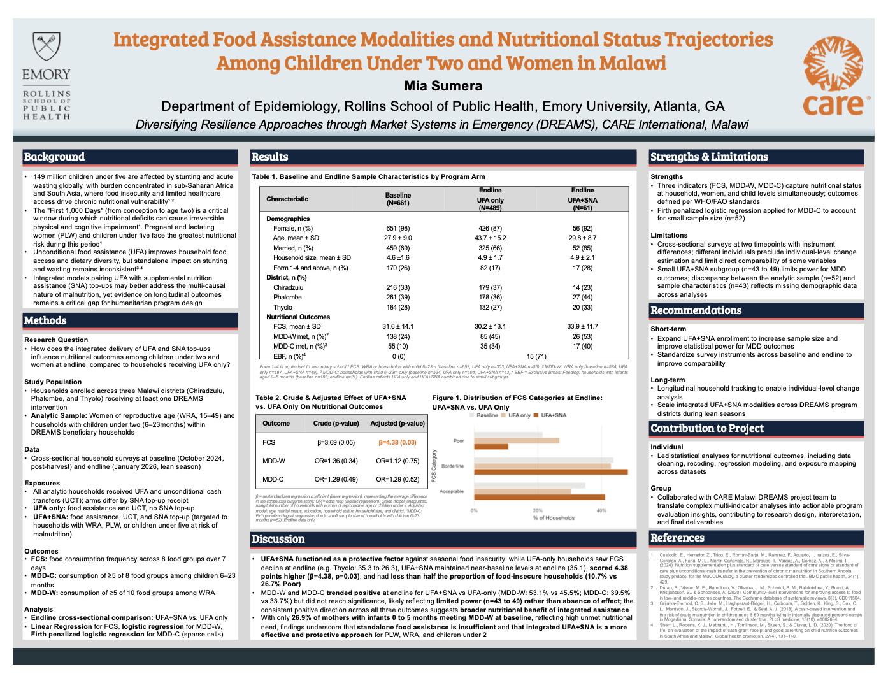

### [DATA 550 Final Project](https://github.com/msumer2/data550_finproj)

Data Science Toolkit (DATA 550) final project analyzing the **"Predict Students' Dropout and Academic Success"** dataset from UC Irvine's Machine Learning Repository. This analysis explores factors associated with student dropout and academic success.

---


### [Capstone Evaluation Dashboard: CARE DREAMS Malawi](https://msumer2.github.io/data555_dashboard/DREAMS_Dashboard.html)

Dashboard created in Current Topics of Data Science (DATA 555) for my spring capstone project, **CARE International, Malawi — DREAMS** (Diversifying Resilience Approaches through Market Systems in Emergency).

```{r, echo=FALSE, fig.align='left', out.width='50%'}

```

---

### [Applied Practical Experience: Deliverable 1](files/baseline_report_25.pdf)

Statewide baseline report completed for my **Applied Practical Experience** position. Analyzed GaDOE surveys (GSHS, GSCS) to evaluate need and identify areas of support for students across Georgia. One of three deliverables required for program.

---


